<div align="center">
    <a align="center" href="https://github.com/cakraawijaya" target="_blank"></a>
    <a align="center" href="https://scholar.google.co.id/citations?user=g3gskSsAAAAJ&hl=id/" target="_blank"></a>
    <a align="center" href="mailto:devancakra6@gmail.com" target="_blank"></a><br/>
    <a align="center" href="https://www.linkedin.com/in/cakraawijaya" target="_blank"></a>
    <a align="center" href="https://www.medium.com/@cakraawijaya" target="_blank"></a>
    <a align="center" href="https://www.youtube.com/@cakraawijaya" target="_blank"></a>
    <a align="center" href="https://www.instagram.com/cakraa.wijaya" target="_blank"></a>
    <a align="center" href="https://www.tiktok.com/@cakraawijaya" target="_blank"></a>
    <a align="center" href="https://cakraawijaya.vercel.app/" target="_blank"></a>
</div>

<br/>

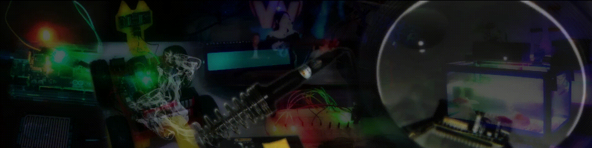

<h2></h2><h2 id="about" align="center">👤 About me</h2>
<div align="center">
    
 Hi everyone... &nbsp; You can call me <strong>``` Devan / Cakra ```</strong>, welcome to my Github.<br/><br/>I'm a <strong>``` Bachelor of Computer Science (S.Kom) ```</strong> from <strong>``` UPN Veteran Jatim ```</strong>.<br/><br/>I'm adaptable, like to learn new things, can work in a team or individually, & can solve problems.<br/><br/>My expertise: ``` Robotics & Embedded System ```, ``` Internet of Things ```, ``` Software Engineering ```.

</div>

<br/><br/>

<h2></h2><h2 id="basicknowledge" align="center">💻 Basic Knowledge Skills</h2>
<div align="center">
<p>Some of the Programming Languages, Development Tools, and other things I've used for work.</p><br/><br/>
    
<table align="center">
    <p id="programminglanguage"><strong>Programming Language</strong></p>
    <tr>
        <td align="center" width="96" height="96">
            <a href="#programminglanguage">
                
            </a><br/>
            <p>C</p>
        </td>
        <td align="center" width="96" height="96">
            <a href="#programminglanguage">
                
            </a><br/>
            <p>C++</p>
        </td>
        <td align="center" width="96" height="96">
            <a href="#programminglanguage">
                
            </a><br/>
            <p>C#</p>
        </td>
        <td align="center" width="96" height="96">
            <a href="#programminglanguage">
                
            </a><br/>
            <p>Visual Basic .Net</p>
        </td>
        <td align="center" width="96" height="96">
            <a href="#programminglanguage">
                
            </a><br/>
            <p>Visual Basic 6</p>
        </td>
        <td align="center" width="96" height="96">
            <a href="#programminglanguage">
                
            </a><br/>
            <p>JavaScript</p>
        </td>
        <td align="center" width="96" height="96">
            <a href="#programminglanguage">
                
            </a><br/>
            <p>PHP</p>
        </td>
    </tr>
    <tr>
        <td align="center" width="96" height="96">
            <a href="#programminglanguage">
                
            </a><br/>
            <p>SQL</p>
        </td>
        <td align="center" width="96" height="96">
            <a href="#programminglanguage">
                
            </a><br/>
            <p>Python</p>
        </td>
        <td align="center" width="96" height="96">
            <a href="#programminglanguage">
                
            </a><br/>
            <p>MicroPython</p>
        </td>
        <td align="center" width="96" height="96">
            <a href="#programminglanguage">
                
            </a><br/>
            <p>TypeScript</p>
        </td>
    </tr>
</table><br/>
<table align="center">
    <p id="frontend"><strong>Frontend</strong></p>
    <tr>
        <td align="center" width="96" height="96">
            <a href="#frontend">
                
            </a><br/>
            <p>Tailwind CSS</p>
        </td>
        <td align="center" width="96" height="96">
            <a href="#frontend">
                
            </a><br/>
            <p>Bootstrap</p>
        </td>
        <td align="center" width="96" height="96">
            <a href="#frontend">
                
            </a><br/>
            <p>Vue.js</p>
        </td>
        <td align="center" width="96" height="96">
            <a href="#frontend">
                
            </a><br/>
            <p>Next.js 15</p>
        </td>
        <td align="center" width="96" height="96">
            <a href="#frontend">
                
            </a><br/>
            <p>React.js</p>
        </td>
        <td align="center" width="96" height="96">
            <a href="#frontend">
                
            </a><br/>
            <p>Font Awesome</p>
        </td>
        <td align="center" width="96" height="96">
            <a href="#frontend">
                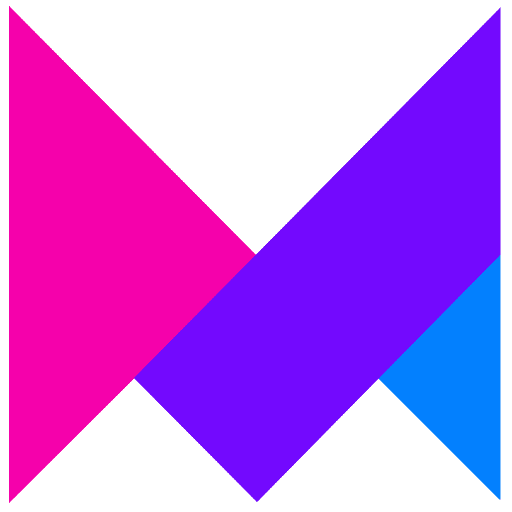
            </a><br/>
            <p>Framer Motion</p>
        </td>
    </tr>
</table><br/>
<table align="center">
    <p id="database_backend"><strong>Database and Backend</strong></p>
    <tr>
        <td align="center" width="96" height="96">
            <a href="#database_backend">
                
            </a><br/>
            <p>Codeigniter</p>
        </td>
        <td align="center" width="96" height="96">
            <a href="#database_backend">
                
            </a><br/>
            <p>Laravel</p>
        </td>
        <td align="center" width="96" height="96">
            <a href="#database_backend">
                
            </a><br/>
            <p>Node.js</p>
        </td>
        <td align="center" width="96" height="96">
            <a href="#database_backend">
                
            </a><br/>
            <p>Express.js</p>
        </td> 
        <td align="center" width="96" height="96">
            <a href="#database_backend">
                
            </a><br/>
            <p>Botman</p>
        </td>
        <td align="center" width="96" height="96">
            <a href="#database_backend">
                
            </a><br/>
            <p>MySQL</p>
        </td>
        <td align="center" width="96" height="96">
            <a href="#database_backend">
                
            </a><br/>
            <p>MariaDB</p>
        </td>
    </tr>
    <tr>
        <td align="center" width="96" height="96">
            <a href="#database_backend">
                
            </a><br/>
            <p>PostgreSQL</p>
        </td>      
        <td align="center" width="96" height="96">
            <a href="#database_backend">
                
            </a><br/>
            <p>MongoDB</p>
        </td>
        <td align="center" width="96" height="96">
            <a href="#database_backend">
                
            </a><br/>
            <p>Firebase</p>
        </td>
        <td align="center" width="96" height="96">
            <a href="#database_backend">
                
            </a><br/>
            <p>InfluxDB</p>
        </td>
        <td align="center" width="96" height="96">
            <a href="#database_backend">
                
            </a><br/>
            <p>Composer</p>
        </td>
    </tr>
</table><br/>
<table align="center">
    <p id="embeddedsystems_iot"><strong>Embedded Systems and IoT</strong></p>
    <tr>
        <td align="center" width="96" height="96">
            <a href="#embeddedsystems_iot">
                
            </a><br/>
            <p>Arduino</p>
        </td>
        <td align="center" width="96" height="96">
            <a href="#embeddedsystems_iot">
                
            </a><br/>
            <p>ESP32 / ESP8266</p>
        </td>
        <td align="center" width="96" height="96">
            <a href="#embeddedsystems_iot">
                
            </a><br/>
            <p>STM8 / STM32</p>
        </td>
        <td align="center" width="96" height="96">
            <a href="#embeddedsystems_iot">
                
            </a><br/>
            <p>Raspberry Pi Pico</p>
        </td>
        <td align="center" width="96" height="96">
            <a href="#embeddedsystems_iot">
                
            </a><br/>
            <p>Blynk IoT</p>
        </td>
        <td align="center" width="96" height="96">
            <a href="#embeddedsystems_iot">
                
            </a><br/>
            <p>Shiftr.io</p>
        </td>
        <td align="center" width="96" height="96">
            <a href="#embeddedsystems_iot">
                
            </a><br/>
            <p>Ubidots</p>
        </td>     
    </tr>
    <tr>
        <td align="center" width="96" height="96">
            <a href="#embeddedsystems_iot">
                
            </a><br/>
            <p>ThingsBoard</p>
        </td>
        <td align="center" width="96" height="96">
            <a href="#embeddedsystems_iot">
                
            </a><br/>
            <p>ThingSpeak</p>
        </td>
        <td align="center" width="96" height="96">
            <a href="#embeddedsystems_iot">
                
            </a><br/>
            <p>Mosquitto</p>
        </td>
        <td align="center" width="96" height="96">
            <a href="#embeddedsystems_iot">
                
            </a><br/>
            <p>i-ot.net</p>
        </td>
        <td align="center" width="96" height="96">
            <a href="#embeddedsystems_iot">
                
            </a><br/>
            <p>Antares</p>
        </td>
        <td align="center" width="96" height="96">
            <a href="#embeddedsystems_iot">
                
            </a><br/>
            <p>Node-RED</p>
        </td>
        <td align="center" width="96" height="96">
            <a href="#embeddedsystems_iot">
                
            </a><br/>
            <p>EMQX</p>
        </td>
    </tr>
    <tr>
        <td align="center" width="96" height="96">
            <a href="#embeddedsystems_iot">
                
            </a><br/>
            <p>HiveMQ</p>
        </td>
        <td align="center" width="96" height="96">
            <a href="#embeddedsystems_iot">
                
            </a><br/>
            <p>Thinger.io</p>
        </td>     
        <td align="center" width="96" height="96">
            <a href="#embeddedsystems_iot">
                
            </a><br/>
            <p>Grafana</p>
        </td>
        <td align="center" width="96" height="96">
            <a href="#embeddedsystems_iot">
                
            </a><br/>
            <p>Kodular</p>
        </td>
        <td align="center" width="96" height="96">
            <a href="#embeddedsystems_iot">
                
            </a><br/>
            <p>MIT App Inventor</p>
        </td>
        <td align="center" width="96" height="96">
            <a href="#embeddedsystems_iot">
                
            </a><br/>
            <p>MQTTX</p>
        </td>
        <td align="center" width="96" height="96">
            <a href="#embeddedsystems_iot">
                
            </a><br/>
            <p>PlatformIO</p>
        </td>
    </tr>
    <tr>
        <td align="center" width="96" height="96">
            <a href="#embeddedsystems_iot">
                
            </a><br/>
            <p>MQTT</p>
        </td>
        <td align="center" width="96" height="96">
            <a href="#embeddedsystems_iot">
                
            </a><br/>
            <p>WebSocket</p>
        </td>
    </tr>
</table><br/>
<table align="center">
    <p id="others"><strong>Others</strong></p>
    <tr>      
        <td align="center" width="96" height="96">
            <a href="#others">
                
            </a><br/>
            <p>Visual Studio</p>
        </td>
        <td align="center" width="96" height="96">
            <a href="#others">
                
            </a><br/>
            <p>VS Code</p>
        </td>
        <td align="center" width="96" height="96">
            <a href="#others">
                
            </a><br/>
            <p>XAMPP</p>
        </td>
        <td align="center" width="96" height="96">
            <a href="#others">
                
            </a><br/>
            <p>Laragon</p>
        </td>
        <td align="center" width="96" height="96">
            <a href="#others">
                
            </a><br/>
            <p>Ngrok</p>
        </td>
        <td align="center" width="96" height="96">
            <a href="#others">
                
            </a><br/>
            <p>Apache</p>
        </td>
        <td align="center" width="96" height="96">
            <a href="#others">
                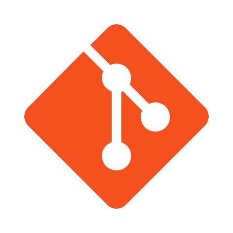
            </a><br/>
            <p>Git</p>
        </td>
    </tr>
    <tr>
        <td align="center" width="96" height="96">
            <a href="#others">
                
            </a><br/>
            <p>Github</p>
        </td>      
        <td align="center" width="96" height="96">
            <a href="#others">
                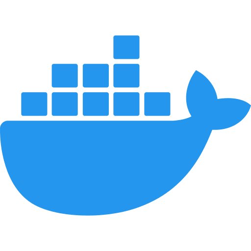
            </a><br/>
            <p>Docker</p>
        </td>
        <td align="center" width="96" height="96">
            <a href="#others">
                
            </a><br/>
            <p>Twilio</p>
        </td>
        <td align="center" width="96" height="96">
            <a href="#others">
                
            </a><br/>
            <p>Fonnte</p>
        </td>
        <td align="center" width="96" height="96">
            <a href="#others">
                
            </a><br/>
            <p>Telegram API</p>
        </td>
        <td align="center" width="96" height="96">
            <a href="#others">
                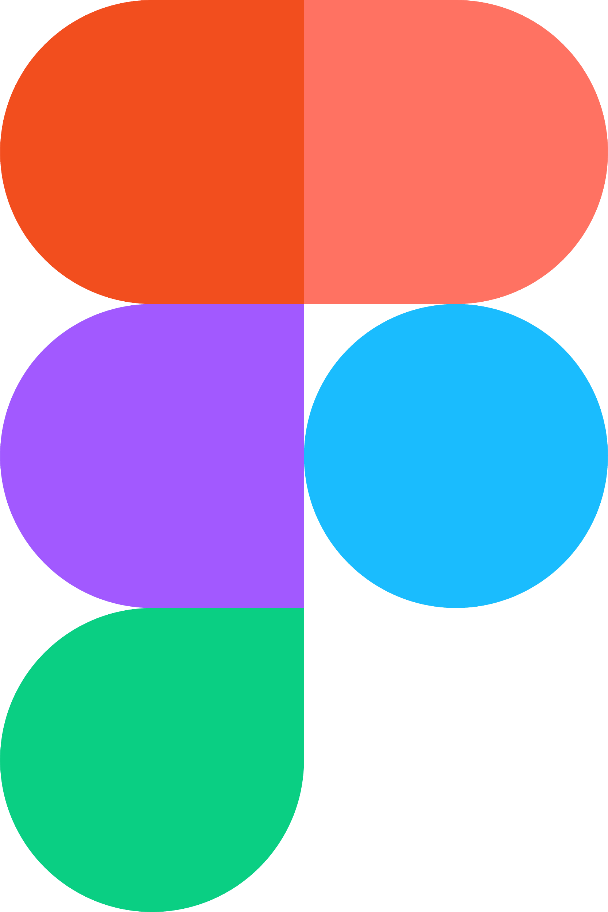
            </a><br/>
            <p>Figma</p>
        </td>
        <td align="center" width="96" height="96">
            <a href="#others">
                
            </a><br/>
            <p>Autodesk Eagle</p>
        </td>
    </tr>
    <tr>
        <td align="center" width="96" height="96">
            <a href="#others">
                
            </a><br/>
            <p>EasyEDA</p>
        </td>
        <td align="center" width="96" height="96">
            <a href="#others">
                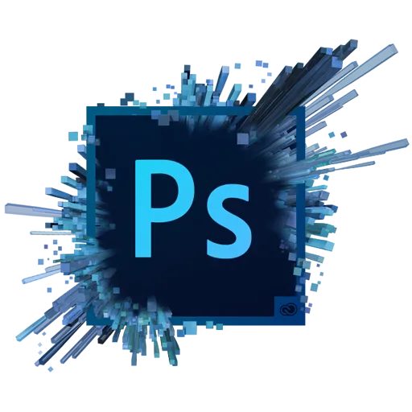
            </a><br/>
            <p>Adobe Photoshop</p>
        </td>      
        <td align="center" width="96" height="96">
            <a href="#others">
                
            </a><br/>
            <p>Canva</p>
        </td>
        <td align="center" width="96" height="96">
            <a href="#others">
                
            </a><br/>
            <p>Microsoft Office</p>
        </td>
    </tr>
</table>
</div>

<br/><br/>

<h2></h2><h2 id="community" align="center">♻️ My Community</h2>

<br/>

<div align="center">
  <a align="center" href="https://www.instagram.com/robotics.upnjatim/" target="_blank">
    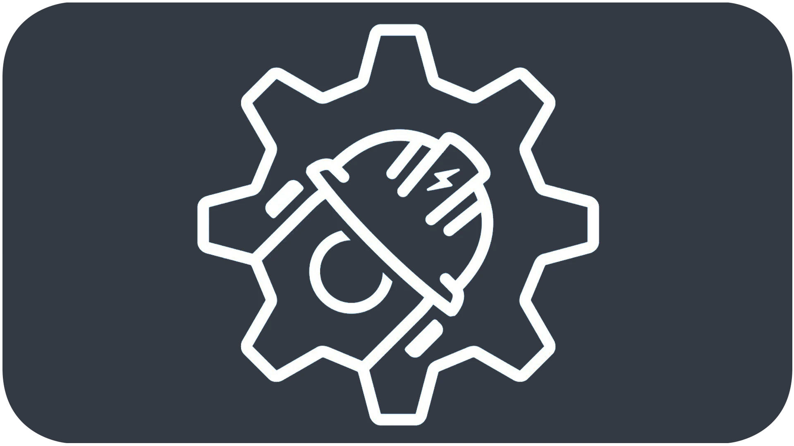
  </a>
  <a align="center" href="https://digitalent.komdigi.go.id/" target="_blank">
    
  </a>
  <a align="center" href="https://edspert.id/" target="_blank">
    
  </a>
  <a align="center" href="https://www.dicoding.com/" target="_blank">
    
  </a>
  <a align="center" href="https://nusabot.id/" target="_blank">
    
  </a>
  <br/>
  <a align="center" href="https://t.me/ardumeka" target="_blank">
    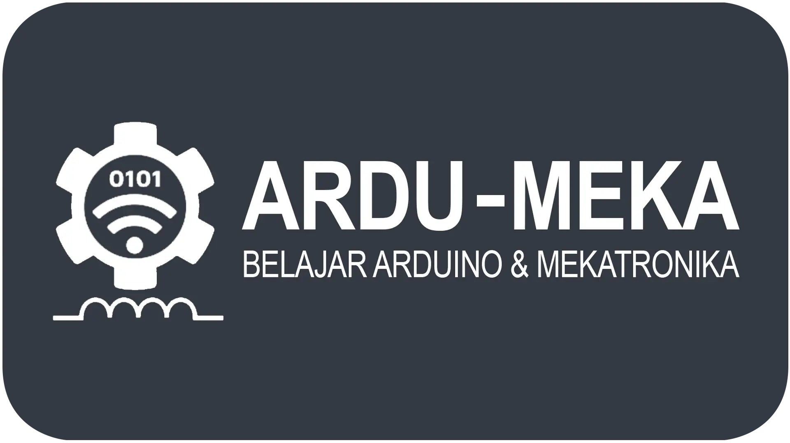
  </a>
  <a align="center" href="https://t.me/kelasrobotgrup" target="_blank">
    
  </a>
  <br/>
  <a align="center" href="https://indobot.co.id/" target="_blank">
    
  </a>
  <a align="center" href="https://progate.com/" target="_blank">
    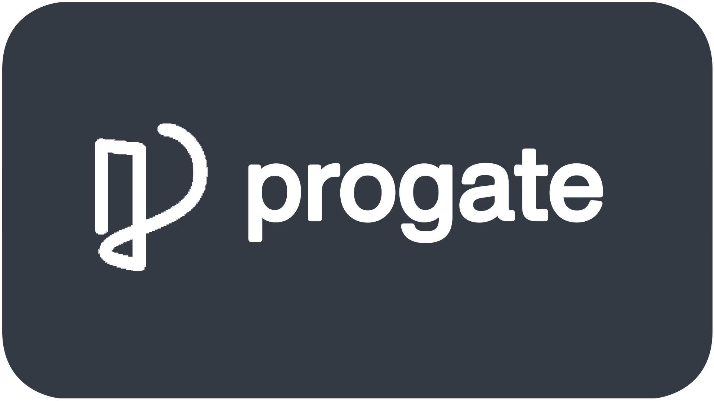
  </a>
  <a align="center" href="https://kelasiot.id/" target="_blank">
    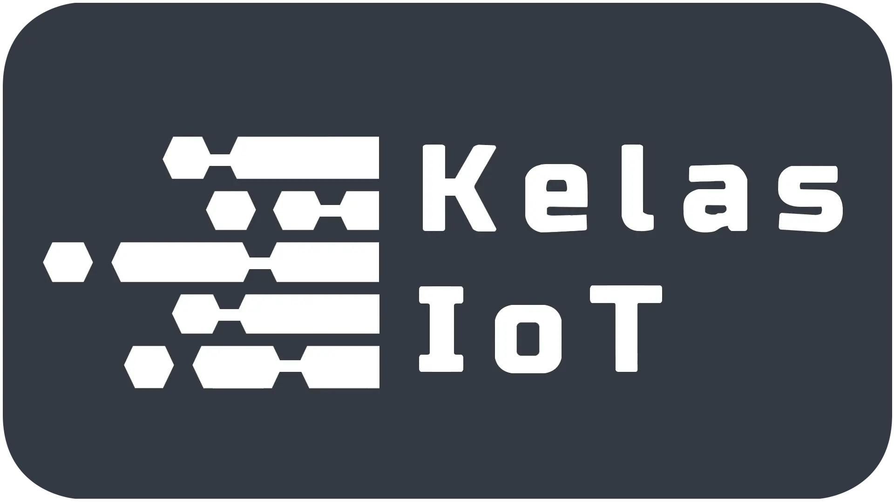
  </a>
  <a align="center" href="https://edutic.id/" target="_blank">
    
  </a>
  <a align="center" href="https://www.ics-cademy.com/" target="_blank">
    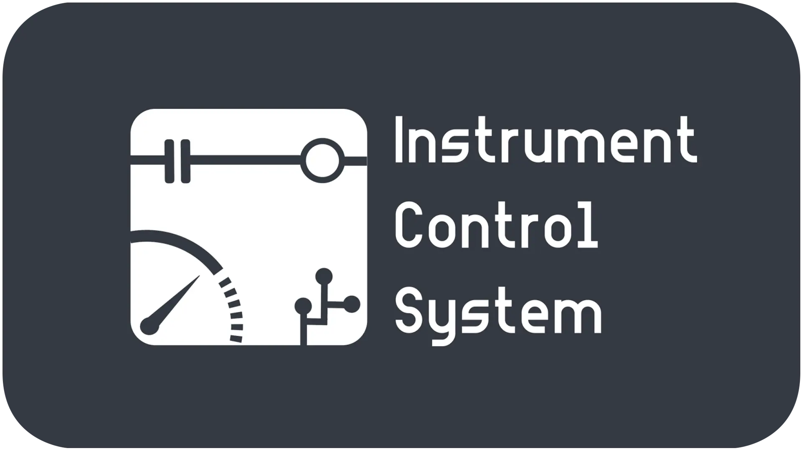
  </a>
</div><br/><br/><br/>

<div class="container" id="githubstats" align="center">
  &nbsp;&nbsp;&nbsp;&nbsp;
      
  
</div>
