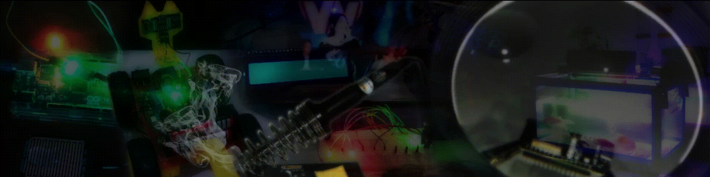
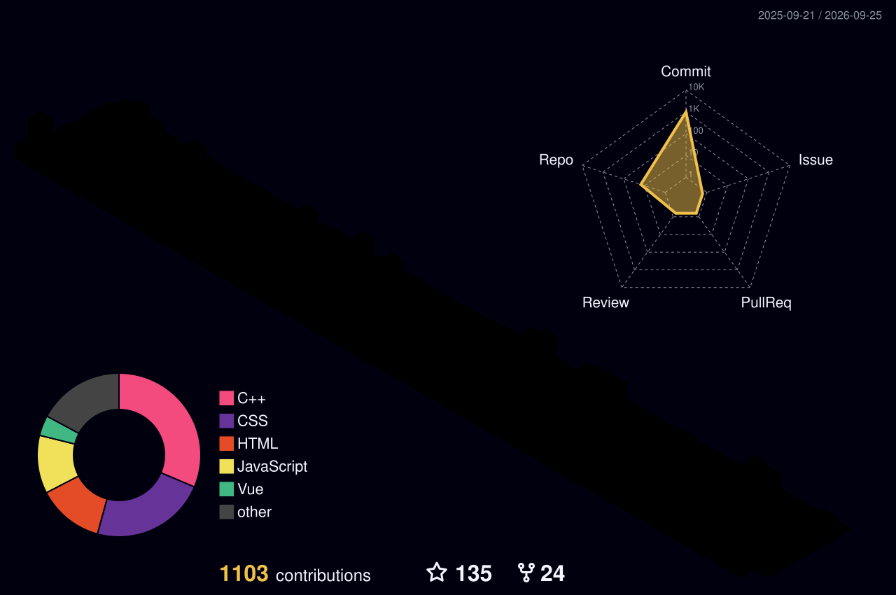

<br/>

<h1 align="center">👋 Devan Cakra Mudra Wijaya</h1>

<div align="center">
    
<p><em>Hey there! Thanks for stopping by. Have a look around and stay as long as you like.</em></p>

<span>My expertise: ``` Robotics & Embedded System ```, ``` Internet of Things ```, ``` Software Engineering ```.</span>


    
</div>


<br/>

<h2></h2><h2 align="left">🧑‍💻 About me</h2>

<div align="justify">

A Software Developer with a Bachelor’s degree in Informatics who focused on web development and IoT integration. Experienced in building systems such as clinic service, warehouse and workforce management, as well as real-time remote device monitoring and control platforms. Was accustomed to using both native web technologies and frameworks, and was able to collaborate via GitHub. Was oriented toward efficient solutions, and continuously developed in modern technology to deliver value for users and businesses.<br/><br/>
Willing to relocate: Anywhere.

</div>

<br/>

<h2></h2><h2 align="left">📖 Education</h2>
<p><strong>Bachelor of Computer Science, Informatics</strong></p>
<span align="justify">Universitas Pembangunan Nasional "Veteran" Jawa Timur &nbsp;&nbsp;|&nbsp;&nbsp; Surabaya, Indonesia &nbsp;&nbsp;|&nbsp;&nbsp; 2018 - 2022</span><br/><br/>
<ul>
    <li><span><strong>GPA:</strong> &nbsp;3.79 (CUM LAUDE) 🏆</span></li><br/>
    <li><span><strong>Specialization:</strong> &nbsp;Web Development & Internet of Things (IoT).</span></li><br/>
    <li><span><strong>Undergraduate Thesis:</strong> &nbsp;Kendali dan Monitoring pH Air Akuaponik Berbasis IoT Dengan Metode Fuzzy Type-2.</span></li><br/>
    <li><span><strong>Undergraduate Program:</strong> &nbsp;Research Assistant for ±2 years in the PPS-TI and SCR Laboratories.</span></li>
</ul>

<br/>

<h2></h2><h2 align="left">🌟 Featured Projects</h2>
<span align="justify">Over the years, I've built and explored projects ranging from web development and embedded systems to IoT, automation, and more. These projects reflect my hands-on experience, continuous learning, and commitment to delivering solutions that are relevant, effective, and aligned with real-world needs.</span>
<br/><br/>

<table>
    <tr>
        <th>Project</th>
        <th>Stack</th>
        <th>What it does</th>
    </tr>
    <tr>
        <td><h5><a href="https://github.com/cakraawijaya/Automatic-Weather-System">Automatic Weather System</a></h5></td>
        <td><sub><strong>ESP32</strong> · <strong>MQTT</strong> · <strong>Node-RED</strong> · <strong>MySQL</strong> · <strong>Telegram</strong></sub></td>
        <td><span>Real-time weather monitoring system — monitors river water level, temperature, and humidity with live dashboard visualization, historical data logging, early warning alerts, and synchronized threshold control via Telegram.</span></td>
    </tr>
    <tr>
        <td><h5><a href="https://github.com/cakraawijaya/TH-Monitoring-NodeRED">TH-Monitoring-NodeRED</a></h5></td>
        <td><sub><strong>ESP32</strong> · <strong>MODBUS TCP/IP</strong> · <strong>Node-RED</strong> · <strong>MySQL</strong></sub></td>
        <td><span>Real-time environmental monitoring dashboard — tracks temperature and humidity with historical data logging, time-range filtering, CSV export, and data management.</span></td>
    </tr>
    <tr>
        <td><h5><a href="https://github.com/cakraawijaya/Local-WebBase-FOTA">Local Web-Based FOTA</a></h5></td>
        <td><sub><strong>ESP32</strong> · <strong>HTTP</strong> · <strong>OTA / FOTA</strong></sub></td>
        <td><span>Web-based IoT monitoring, control, and firmware management system — monitors temperature and humidity, enables remote lamp control, provides authenticated web access, CSV data export, and enables wireless firmware updates over a local network.</span></td>
    </tr>
</table>

<br/>

<h2></h2><h2 align="left">🛠️ Tech Stack</h2>
<span align="justify">Some of the Programming Languages, Development Tools, and other things I've used for work.</span>
<br/><br/>

<table>
    <tr>
        <td align="center" width="140" rowspan="2">
            <h5>Programming Language</h5>
        </td>
        <td align="center" width="96">
            <br/>
            <sub>C</sub>
        </td>
        <td align="center" width="96">
            <br/>
            <sub>C++</sub>
        </td>
        <td align="center" width="96">
            <br/>
            <sub>C#</sub>
        </td>
        <td align="center" width="96">
            <br/>
            <sub>VB 6</sub>
        </td>
        <td align="center" width="96">
            <br/>
            <sub>PHP</sub>
        </td>
        <td align="center" width="96">
            <br/>
            <sub>Python</sub>
        </td>
        <td align="center" width="96">
            <br/>
            <sub>MicroPython</sub>
        </td>
    </tr>
    <tr>
        <td align="center" width="96">
            <br/>
            <sub>JavaScript</sub>
        </td>
        <td align="center" width="96">
            <br/>
            <sub>TypeScript</sub>
        </td>
        <td align="center" width="96">
            <br/>
            <sub>Go</sub>
        </td>
        <td align="center" width="96">
            <br/>
            <sub>SQL</sub>
        </td>
    </tr>
</table>
<table>
    <tr>
        <td align="center" width="140">
            <h5>Frontend</h5>
        </td>
        <td align="center" width="96">
            <br/>
            <sub>Bootstrap</sub>
        </td>
        <td align="center" width="96">
            <br/>
            <sub>Tailwind</sub>
        </td>
        <td align="center" width="96">
            <br/>
            <sub>Vue.js</sub>
        </td>
        <td align="center" width="96">
            <br/>
            <sub>React.js</sub>
        </td>
        <td align="center" width="96">
            <br/>
            <sub>Next.js</sub>
        </td>
    </tr>
</table>
<table>
    <tr>
        <td align="center" width="140" rowspan="2">
            <h5>Backend, Runtime, Server & Database</h5>
        </td>
        <td align="center" width="96">
            <br/>
            <sub>Codeigniter</sub>
        </td>
        <td align="center" width="96">
            <br/>
            <sub>Laravel</sub>
        </td>
        <td align="center" width="96">
            <br/>
            <sub>Express.js</sub>
        </td>
        <td align="center" width="96">
            <br/>
            <sub>Node.js</sub>
        </td>
        <td align="center" width="96">
            <br/>
            <sub>Apache</sub>
        </td>
        <td align="center" width="96">
            <br/>
            <sub>MySQL</sub>
        </td>
        <td align="center" width="96">
            <br/>
            <sub>MariaDB</sub>
        </td>
    </tr>
    <tr>
        <td align="center" width="96">
            <br/>
            <sub>PostgreSQL</sub>
        </td>
        <td align="center" width="96">
            <br/>
            <sub>MongoDB</sub>
        </td>
        <td align="center" width="96">
            <br/>
            <sub>Firebase</sub>
        </td>
        <td align="center" width="96">
            <br/>
            <sub>InfluxDB</sub>
        </td>
    </tr>
</table>
<table>
    <tr>
        <td align="center" width="140">
            <h5>Web Development Tools</h5>
        </td>
        <td align="center" width="96">
            <br/>
            <sub>Composer</sub>
        </td>
        <td align="center" width="96">
            <br/>
            <sub>VS Code</sub>
        </td>
        <td align="center" width="96">
            <br/>
            <sub>Kiro</sub>
        </td>
        <td align="center" width="96">
            <br/>
            <sub>XAMPP</sub>
        </td>
        <td align="center" width="96">
            <br/>
            <sub>Laragon</sub>
        </td>
        <td align="center" width="96">
            <br/>
            <sub>Ngrok</sub>
        </td>
        <td align="center" width="96">
            <br/>
            <sub>Postman</sub>
        </td>
    </tr>
</table>
<table>
    <tr>
        <td align="center" width="140">
            <h5>Development Board</h5>
        </td>
        <td align="center" width="96">
            <br/>
            <sub>Arduino</sub>
        </td>
        <td align="center" width="96">
            <br/>
            <sub>ESP32 /<br/>ESP8266</sub>
        </td>
        <td align="center" width="96">
            <br/>
            <sub>STM8 /<br/>STM32</sub>
        </td>
        <td align="center" width="96">
            <br/>
            <sub>Raspberry Pi</sub>
        </td>
    </tr>
</table>
<table>
    <tr>
        <td align="center" width="140" rowspan="2">
            <h5>Communication Protocols & Hardware Interfaces</h5>
        </td>
        <td align="center" width="96">
            <br/>
            <sub>TCP / IP</sub>
        </td>
        <td align="center" width="96">
            <br/>
            <sub>HTTP</sub>
        </td>
        <td align="center" width="96">
            <br/>
            <sub>MQTT</sub>
        </td>
        <td align="center" width="96">
            <br/>
            <sub>WebSocket</sub>
        </td>
        <td align="center" width="96">
            <br/>
            <sub>MODBUS</sub>
        </td>
        <td align="center" width="96">
            <br/>
            <sub>I2C</sub>
        </td>
        <td align="center" width="96">
            <br/>
            <sub>UART</sub>
        </td>
    </tr>
    <tr>
        <td align="center" width="96">
            <br/>
            <sub>SPI</sub>
        </td>
        <td align="center" width="96">
            <br/>
            <sub>RS485</sub>
        </td>
    </tr>
</table>
<table>
    <tr>
        <td align="center" width="140" rowspan="2">
            <h5>IoT Platform & MQTT Broker</h5>
        </td>
        <td align="center" width="96">
            <br/>
            <sub>Blynk</sub>
        </td>
        <td align="center" width="96">
            <br/>
            <sub>Ubidots</sub>
        </td>
        <td align="center" width="96">
            <br/>
            <sub>ThingSpeak</sub>
        </td>
        <td align="center" width="96">
            <br/>
            <sub>Thinger.io</sub>
        </td>
        <td align="center" width="96">
            <br/>
            <sub>Antares</sub>
        </td>
        <td align="center" width="96">
            <br/>
            <sub>ThingsBoard</sub>
        </td>
        <td align="center" width="96">
            <br/>
            <sub>HiveMQ</sub>
        </td>
    </tr>
    <tr>
        <td align="center" width="96">
            <br/>
            <sub>Mosquitto</sub>
        </td>
        <td align="center" width="96">
            <br/>
            <sub>EMQX</sub>
        </td>
        <td align="center" width="96">
            <br/>
            <sub>Shiftr.io</sub>
        </td>
        <td align="center" width="96">
            <br/>
            <sub>i-ot.net</sub>
        </td>
    </tr>
</table>
<table>
    <tr>
        <td align="center" width="140" rowspan="2">
            <h5>Hardware, IoT Development & Integration Tools</h5>
        </td>
        <td align="center" width="96">
            <br/>
            <sub>EasyEDA</sub>
        </td>
        <td align="center" width="96">
            <br/>
            <sub>Eagle</sub>
        </td>
        <td align="center" width="96">
            <br/>
            <sub>PlatformIO</sub>
        </td>
        <td align="center" width="96">
            <br/>
            <sub>Node-RED</sub>
        </td>
        <td align="center" width="96">
            <br/>
            <sub>Grafana</sub>
        </td>
        <td align="center" width="96">
            <br/>
            <sub>MQTTX</sub>
        </td>
        <td align="center" width="96">
            <br/>
            <sub>Kodular</sub>
        </td>
    </tr>
    <tr>
        <td align="center" width="96">
            <br/>
            <sub>MIT App<br/>Inventor</sub>
        </td>
        <td align="center" width="96">
            <br/>
            <sub>Visual<br/>Studio</sub>
        </td>
        <td align="center" width="96">
            <br/>
            <sub>Fonnte</sub>
        </td>
        <td align="center" width="96">
            <br/>
            <sub>Telegram Bot</sub>
        </td>
        <td align="center" width="96">
            <br/>
            <sub>MODSCAN</sub>
        </td>
        <td align="center" width="96">
            <br/>
            <sub>MODBUS POLL</sub>
        </td>
    </tr>
</table>
<table>
    <tr>
        <td align="center" width="140">
            <h5>DevOps & Version Control</h5>
        </td>
        <td align="center" width="96">
            <br/>
            <sub>Docker</sub>
        </td>
        <td align="center" width="96">
            <br/>
            <sub>Git</sub>
        </td>
        <td align="center" width="96">
            <br/>
            <sub>GitHub</sub>
        </td>
        <td align="center" width="96">
            <br/>
            <sub>GitLab</sub>
        </td>
    </tr>
</table>
<table>
    <tr>
        <td align="center" width="140">
            <h5>Design & Productivity</h5>
        </td>
        <td align="center" width="96">
            <br/>
            <sub>Figma</sub>
        </td>
        <td align="center" width="96">
            <br/>
            <sub>Canva</sub>
        </td>
        <td align="center" width="96">
            <br/>
            <sub>Adobe<br/>Photoshop</sub>
        </td>
        <td align="center" width="96">
            <br/>
            <sub>Microsoft<br/>Office</sub>
        </td>
        <td align="center" width="96">
            <br/>
            <sub>Microsoft<br/>Visio</sub>
        </td>
    </tr>
</table>

<br/>

<h2></h2><h2 align="left">🏅 Certifications & Awards</h2>

<ul>
    <li><span><strong>Certificate of Innovation & Achievement: &nbsp;EW Project Challenge (2026)</strong>&nbsp; — &nbsp;ElectronicWings x MOUSER, India</li></span>
    <li><span><strong>Bootcamp Perancangan dan Perekayasaan Industrial Internet of Things (2026)</strong>&nbsp; — &nbsp;Edutic.id x BNSP</li></span>
    <li><span><strong>Spec-Driven Development dengan Kiro (2026)</strong>&nbsp; — &nbsp;Dicoding Indonesia</li></span>
    <li><span><strong>AI Productivity and AI API Integration for Developers (2026)</strong>&nbsp; — &nbsp;Hacktiv8 Indonesia</li></span>
    <li><span><strong>Node-RED Fundamentals & Node-RED Advanced (2026)</strong>&nbsp; — &nbsp;Node-RED Academy</li></span>
    <li><span><strong>Data Science for Internet of Things (2026)</strong>&nbsp; — &nbsp;BPVP Sidoarjo</li></span>
    <li><span><strong>Programming for the Internet of Things Project (2023)</strong>&nbsp; — &nbsp;Coursera x University of California, Irvine</li></span>
    <li><span><strong>Intensive Bootcamp "Menjadi IoT Engineer" Batch 10 (2023)</strong>&nbsp; — &nbsp;Edspert.id</li></span>
    <li><span><strong>Internet of Things Batch 4 (2022)</strong>&nbsp; — &nbsp;DTS PROA KOMINFO RI</li></span>
    <li><span><strong>Certificate of Competence: &nbsp;Web Junior Programmer (2022)</strong>&nbsp; — &nbsp;BNSP</li></span>
    <li><span><strong>Certificate of Appreciation: &nbsp;CUM LAUDE (2022)</strong>&nbsp; — &nbsp;UPN "Veteran" Jatim</li></span>
</ul>
&nbsp;&nbsp;
For more information, <a href="https://drive.google.com/drive/folders/1MW0OHl7oECj3zrzVDT_SivkK3WGgUE9n"><strong>Click Here</strong></a>
<br/><br/>

<h2></h2><h2 align="left">🌐 My Community</h2>

<span align="justify">These communities have been an important part of my learning journey. Through them, I've gained knowledge, shared experiences, discovered new perspectives, and learned from people with different backgrounds.</span>
<br/><br/>

<div align="left">
  <a align="center" href="https://www.instagram.com/robotics.upnjatim/" target="_blank">
    
  </a>
  <a align="center" href="https://digitalent.komdigi.go.id/" target="_blank">
    
  </a>
  <a align="center" href="https://edspert.id/" target="_blank">
    
  </a>
  <a align="center" href="https://www.dicoding.com/" target="_blank">
    
  </a>
  <a align="center" href="https://nusabot.id/" target="_blank">
    
  </a>
  <br/>
  <a align="center" href="https://t.me/ardumeka" target="_blank">
    
  </a>
  <a align="center" href="https://t.me/kelasrobotgrup" target="_blank">
    
  </a>
  <a align="center" href="https://indobot.co.id/" target="_blank">
    
  </a>
  <a align="center" href="https://progate.com/" target="_blank">
    
  </a>
  <a align="center" href="https://kelasiot.id/" target="_blank">
    
  </a>
  <br/>
  <a align="center" href="https://edutic.id/" target="_blank">
    
  </a>
  <a align="center" href="https://www.ics-cademy.com/" target="_blank">
    
  </a>
  <a align="center" href="https://learn.wpucourse.id/" target="_blank">
    
  </a>
</div>

<br/>

<h2></h2><h2 align="left">🏗️ Philosophy</h2>

<div align="left"><br/>

<span>
    
> **“Build technology that works and solves real problems.”**
    
</span>

<br/><span>Hardware should be dependable.</span><br/>

<span>Software should be maintainable.</span><br/>

<span>Interfaces should be intuitive.</span><br/>

<span>Technology should serve people — not just connect devices.</span>

</div>

<br/>

<h2></h2><h2 align="left">📊 GitHub Contribution</h2>

<div align="center">
  
</div>

<br/>

<h2></h2><h2 align="left">👀 Visitors</h2>

<div align="left">
    <a align="center" href="https://github.com/cakraawijaya" target="_blank"></a>
</div>

<br/>

<h2></h2><h2 align="left">📫 Let's Connect</h2>

<span align="justify">I'm always happy to connect, exchange ideas, and have meaningful conversations. Whether it's a discussion, a collaboration, or a new opportunity, feel free to reach out. I'd love to hear from you and see what we can create together.</span>
<br/><br/>

<div align="left">
    <a align="center" href="https://www.linkedin.com/in/cakraawijaya" target="_blank"></a>&nbsp;&nbsp;
    <a align="center" href="mailto:devancakra6@gmail.com" target="_blank"></a>&nbsp;&nbsp;
    <a align="center" href="https://scholar.google.co.id/citations?user=g3gskSsAAAAJ&hl=id/" target="_blank"></a>&nbsp;&nbsp;
    <a align="center" href="https://www.youtube.com/@cakraawijaya" target="_blank"></a>&nbsp;&nbsp;
    <a align="center" href="https://cakraawijaya.vercel.app/" target="_blank"></a>&nbsp;&nbsp;
    <a align="center" href="https://www.tiktok.com/@cakraawijaya" target="_blank"></a>&nbsp;&nbsp;
    <a align="center" href="https://www.instagram.com/cakraa.wijaya" target="_blank"></a>
</div>

<br/>
