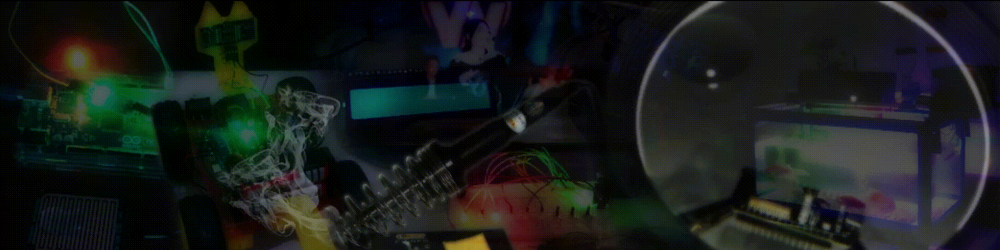
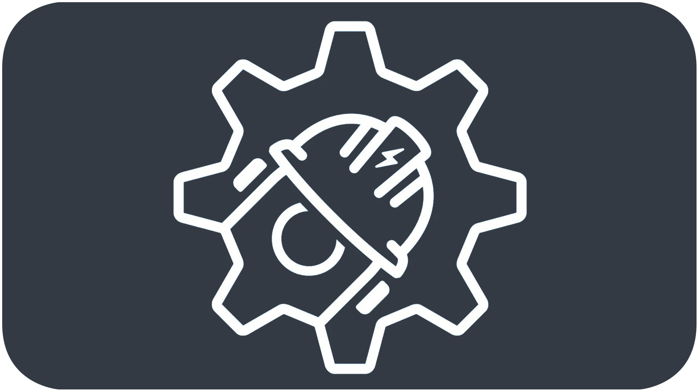
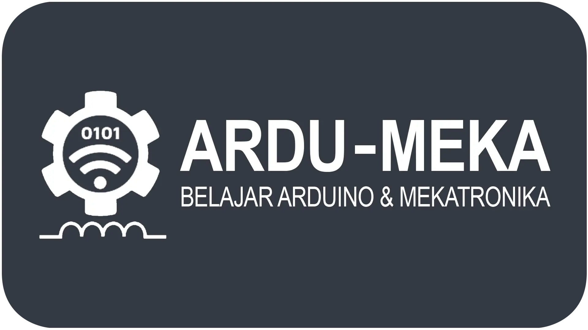
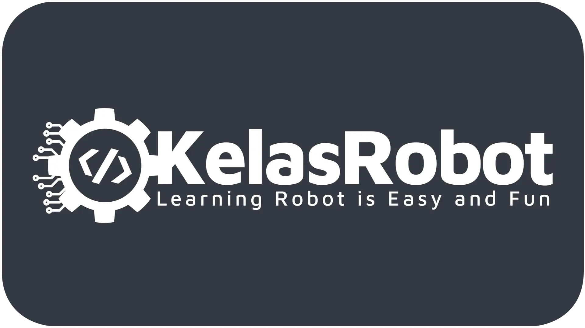
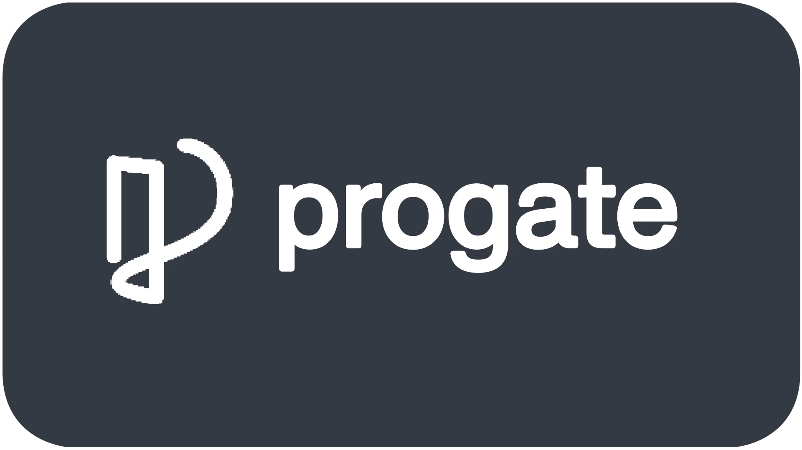
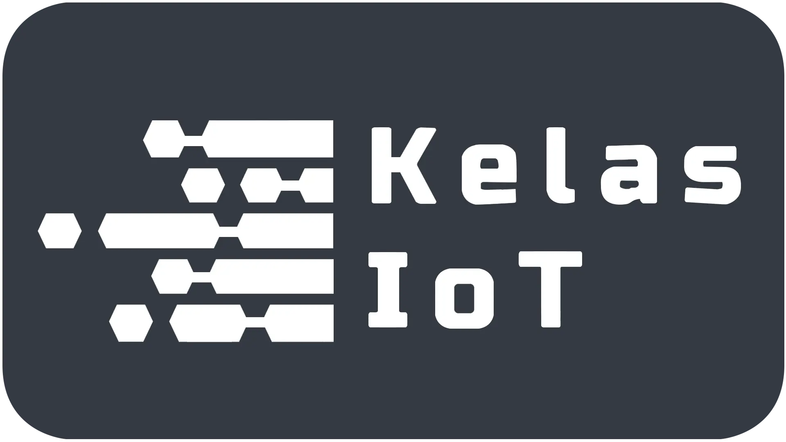
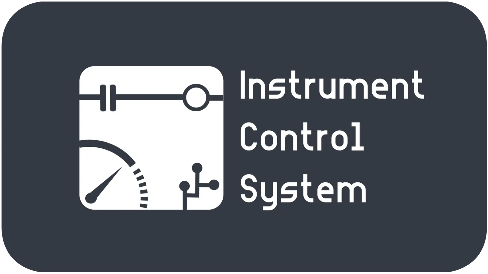

<div align="center">
    <a align="center" href="https://github.com/cakraawijaya" target="_blank"></a>
    <a align="center" href="https://scholar.google.co.id/citations?user=g3gskSsAAAAJ&hl=id/" target="_blank"></a>
    <a align="center" href="mailto:devancakra6@gmail.com" target="_blank"></a><br/>
    <a align="center" href="https://www.linkedin.com/in/cakraawijaya" target="_blank"></a>
    <a align="center" href="https://www.medium.com/@cakraawijaya" target="_blank"></a>
    <a align="center" href="https://www.youtube.com/@cakraawijaya" target="_blank"></a>
    <a align="center" href="https://www.instagram.com/cakraa.wijaya" target="_blank"></a>
    <a align="center" href="https://www.tiktok.com/@cakraawijaya" target="_blank"></a>
    <a align="center" href="https://cakraawijaya.vercel.app/" target="_blank"></a>
</div>

<br/>



<h2></h2><h2 id="about" align="center">👤 About me</h2>
<div align="center">

 Hi everyone... &nbsp; You can call me <strong>``` Devan / Cakra ```</strong>, welcome to my Github.<br/><br/>I'm a <strong>``` Bachelor of Computer Science (S.Kom) ```</strong> from <strong>``` UPN Veteran Jatim ```</strong>.<br/><br/>I'm adaptable, like to learn new things, can work in a team or individually, & can solve problems.<br/><br/>My expertise: ``` Robotics & Embedded System ```, ``` Internet of Things ```, ``` Software Engineering ```.

</div>

<br/><br/>

<h2></h2><h2 id="basicknowledge" align="center">💻 Basic Knowledge Skills</h2>
<div align="center">
<p>Some of the Programming Languages, Development Tools, and other things I've used for work.</p><br/><br/>

<table align="center">
    <tr>
        <th colspan="11" align="center" bgcolor="#F5F0FF">Programming Language</th>
    </tr>
    <tr>
        <td align="center">
            <br/>
            <sub>C</sub>
        </td>
        <td align="center">
            <br/>
            <sub>C++</sub>
        </td>
        <td align="center">
            <br/>
            <sub>C#</sub>
        </td>
        <td align="center">
            <br/>
            <sub>VB 6</sub>
        </td>
        <td align="center">
            <br/>
            <sub>PHP</sub>
        </td>
        <td align="center">
            <br/>
            <sub>SQL</sub>
        </td>
        <td align="center">
            <br/>
            <sub>Python</sub>
        </td>
        <td align="center">
            <br/>
            <sub>MicroPython</sub>
        </td>
        <td align="center">
            <br/>
            <sub>JavaScript</sub>
        </td>
        <td align="center">
            <br/>
            <sub>TypeScript</sub>
        </td>
        <td align="center">
            <br/>
            <sub>Go</sub>
        </td>
    </tr>
</table><br/>
<table align="center">
    <tr>
        <th colspan="5" align="center" bgcolor="#F5F0FF">Frontend</th>
    </tr>
    <tr>
        <td align="center">
            <br/>
            <sub>Bootstrap</sub>
        </td>
        <td align="center">
            <br/>
            <sub>Tailwind</sub>
        </td>
        <td align="center">
            <br/>
            <sub>Vue.js</sub>
        </td>
        <td align="center">
            <br/>
            <sub>React.js</sub>
        </td>
        <td align="center">
            <br/>
            <sub>Next.js</sub>
        </td>
    </tr>
</table><br/>
<table align="center">
    <tr>
        <th colspan="11" align="center" bgcolor="#F5F0FF">Backend, Runtime, Server & Database</th>
    </tr>
    <tr>
        <td align="center">
            <br/>
            <sub>Codeigniter</sub>
        </td>
        <td align="center">
            <br/>
            <sub>Laravel</sub>
        </td>
        <td align="center">
            <br/>
            <sub>Express.js</sub>
        </td>
        <td align="center">
            <br/>
            <sub>Node.js</sub>
        </td>
        <td align="center">
            <br/>
            <sub>Apache</sub>
        </td>
        <td align="center">
            <br/>
            <sub>MySQL</sub>
        </td>
        <td align="center">
            <br/>
            <sub>MariaDB</sub>
        </td>
        <td align="center">
            <br/>
            <sub>PostgreSQL</sub>
        </td>
        <td align="center">
            <br/>
            <sub>MongoDB</sub>
        </td>
        <td align="center">
            <br/>
            <sub>Firebase</sub>
        </td>
        <td align="center">
            <br/>
            <sub>InfluxDB</sub>
        </td>
    </tr>
</table><br/>
<table align="center">
    <tr>
        <th colspan="6" align="center" bgcolor="#F5F0FF">Web Development Tools</th>
    </tr>
    <tr>
        <td align="center">
            <br/>
            <sub>Composer</sub>
        </td>
        <td align="center">
            <br/>
            <sub>VS Code</sub>
        </td>
        <td align="center">
            <br/>
            <sub>XAMPP</sub>
        </td>
        <td align="center">
            <br/>
            <sub>Laragon</sub>
        </td>
        <td align="center">
            <br/>
            <sub>Ngrok</sub>
        </td>
        <td align="center">
            <br/>
            <sub>Postman</sub>
        </td>
    </tr>
</table><br/>
<table align="center">
    <tr>
        <th colspan="4" align="center" bgcolor="#F5F0FF">Development Board</th>
    </tr>
    <tr>
        <td align="center">
            <br/>
            <sub>Arduino</sub>
        </td>
        <td align="center">
            <br/>
            <sub>ESP32 / ESP8266</sub>
        </td>
        <td align="center">
            <br/>
            <sub>STM8 / STM32</sub>
        </td>
        <td align="center">
            <br/>
            <sub>Raspberry Pi</sub>
        </td>
    </tr>
</table><br/>
<table align="center">
    <tr>
        <th colspan="9" align="center" bgcolor="#F5F0FF">Communication Protocols & Hardware Interfaces</th>
    </tr>
    <tr>
        <td align="center">
            <br/>
            <sub>TCP / IP</sub>
        </td>
        <td align="center">
            <br/>
            <sub>HTTP</sub>
        </td>
        <td align="center">
            <br/>
            <sub>MQTT</sub>
        </td>
        <td align="center">
            <br/>
            <sub>WebSocket</sub>
        </td>
        <td align="center">
            <br/>
            <sub>MODBUS</sub>
        </td>
        <td align="center">
            <br/>
            <sub>UART</sub>
        </td>
        <td align="center">
            <br/>
            <sub>I2C</sub>
        </td>
        <td align="center">
            <br/>
            <sub>SPI</sub>
        </td>
        <td align="center">
            <br/>
            <sub>RS485</sub>
        </td>
    </tr>
</table><br/>
<table align="center">
    <tr>
        <th colspan="11" align="center" bgcolor="#F5F0FF">IoT Platform & MQTT Broker</th>
    </tr>
    <tr>
        <td align="center">
            <br/>
            <sub>Blynk</sub>
        </td>
        <td align="center">
            <br/>
            <sub>Ubidots</sub>
        </td>
        <td align="center">
            <br/>
            <sub>ThingSpeak</sub>
        </td>
        <td align="center">
            <br/>
            <sub>Thinger.io</sub>
        </td>
        <td align="center">
            <br/>
            <sub>Antares</sub>
        </td>
        <td align="center">
            <br/>
            <sub>ThingsBoard</sub>
        </td>
        <td align="center">
            <br/>
            <sub>HiveMQ</sub>
        </td>
        <td align="center">
            <br/>
            <sub>Mosquitto</sub>
        </td>
        <td align="center">
            <br/>
            <sub>EMQX</sub>
        </td>
        <td align="center">
            <br/>
            <sub>Shiftr.io</sub>
        </td>
        <td align="center">
            <br/>
            <sub>i-ot.net</sub>
        </td>
    </tr>
</table><br/>
<table align="center">
    <tr>
        <th colspan="9" align="center" bgcolor="#F5F0FF">PCB Design, IoT Development & Integration Tools</th>
    </tr>
    <tr>
        <td align="center">
            <br/>
            <sub>EasyEDA</sub>
        </td>
        <td align="center">
            <br/>
            <sub>Eagle</sub>
        </td>
        <td align="center">
            <br/>
            <sub>PlatformIO</sub>
        </td>
        <td align="center">
            <br/>
            <sub>Node-RED</sub>
        </td>
        <td align="center">
            <br/>
            <sub>Grafana</sub>
        </td>
        <td align="center">
            <br/>
            <sub>MQTTX</sub>
        </td>
        <td align="center">
            <br/>
            <sub>Kodular</sub>
        </td>
        <td align="center">
            <br/>
            <sub>MIT App<br/>Inventor</sub>
        </td>
        <td align="center">
            <br/>
            <sub>Visual<br/>Studio</sub>
        </td>
    </tr>
</table><br/>
<table align="center">
    <tr>
        <th colspan="4" align="center" bgcolor="#F5F0FF">DevOps & Version Control</th>
    </tr>
    <tr>
        <td align="center">
            <br/>
            <sub>Docker</sub>
        </td>
        <td align="center">
            <br/>
            <sub>Git</sub>
        </td>
        <td align="center">
            <br/>
            <sub>Github</sub>
        </td>
        <td align="center">
            <br/>
            <sub>Gitlab</sub>
        </td>
    </tr>
</table><br/>
<table align="center">
    <tr>
        <th colspan="4" align="center" bgcolor="#F5F0FF">Design & Productivity</th>
    </tr>
    <tr>
        <td align="center">
            <br/>
            <sub>Figma</sub>
        </td>
        <td align="center">
            <br/>
            <sub>Canva</sub>
        </td>
        <td align="center">
            <br/>
            <sub>Adobe<br/>Photoshop</sub>
        </td>
        <td align="center">
            <br/>
            <sub>Microsoft<br/>Office</sub>
        </td>
    </tr>
</table>
</div>

<br/><br/>

<h2></h2><h2 id="community" align="center">♻️ My Community</h2>

<br/>

<div align="center">
  <a align="center" href="https://www.instagram.com/robotics.upnjatim/" target="_blank">
    
  </a>
  <a align="center" href="https://digitalent.komdigi.go.id/" target="_blank">
    
  </a>
  <a align="center" href="https://edspert.id/" target="_blank">
    
  </a>
  <a align="center" href="https://www.dicoding.com/" target="_blank">
    
  </a>
  <a align="center" href="https://nusabot.id/" target="_blank">
    
  </a>
  <br/>
  <a align="center" href="https://t.me/ardumeka" target="_blank">
    
  </a>
  <a align="center" href="https://t.me/kelasrobotgrup" target="_blank">
    
  </a>
  <br/>
  <a align="center" href="https://indobot.co.id/" target="_blank">
    
  </a>
  <a align="center" href="https://progate.com/" target="_blank">
    
  </a>
  <a align="center" href="https://kelasiot.id/" target="_blank">
    
  </a>
  <a align="center" href="https://edutic.id/" target="_blank">
    
  </a>
  <a align="center" href="https://www.ics-cademy.com/" target="_blank">
    
  </a>
</div><br/>
